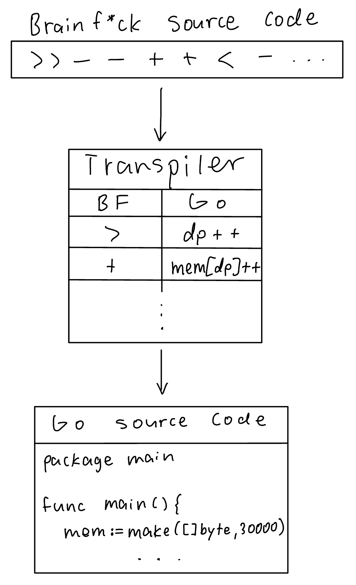
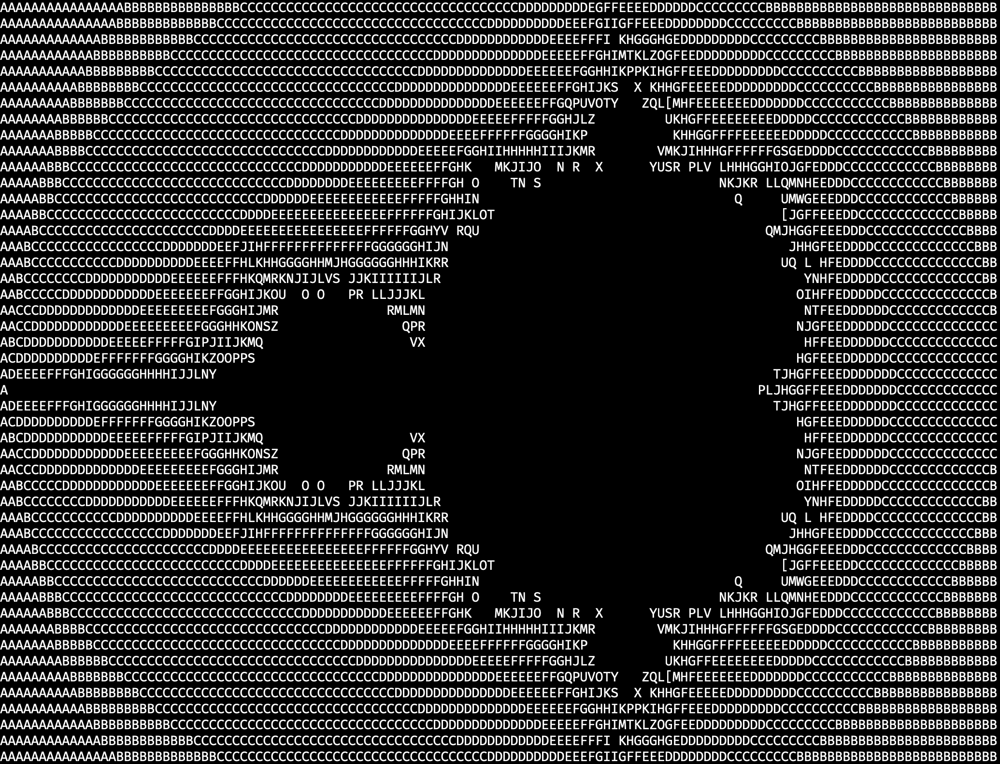

# Brainf*ck to Golang Transpiler


## Description
This is a fully-featured Brainf\*ck transpiler. In other words, it converts Brainf\*ck source code to Go source code. I chose to do it this way because an interpreter would have been slower at executing the code. The transpiler will emit a `program.go` file which is the transpiled version of the input source code. 

## How to Run
```
$ go run main.go path/to/source
$ go run program.go
```
There are many example programs located in the [programs](https://github.com/Broyojo/bf/tree/master/programs) directory.


## Example
```
$ go run main.go programs/mandelbrot.b
$ go run program.go
```
